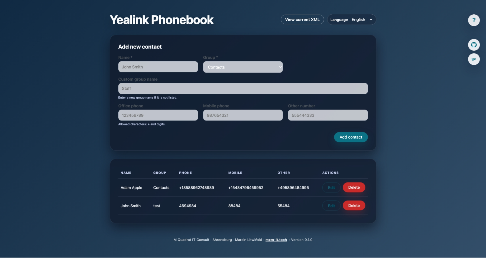

# YeaBook – Yealink phonebook generator

Simple Flask application for managing a Yealink-compatible phonebook. The HTML5 interface lets you add, edit, and remove contacts (including Yealink “groups”), while the generated `phonebook.xml` file is served over HTTP so Yealink phones can fetch the latest version automatically. The XML output follows the remote phonebook structure described in [Christopher Wilkinson’s article](https://christopherwilkinson.co.uk/2025/yealink-telephone-xml-remote-phonebook-hosting/), using `<Menu>` nodes per group and `<Unit>` entries with `Phone1/Phone2/Phone3` attributes.



## Run with Docker

```bash
docker build -t yeabook .
docker run --rm -p 8000:8000 -v $(pwd)/data:/data yeabook
```

- Web UI: http://localhost:8000/
- XML feed: http://localhost:8000/phonebook.xml
- The host `data/` directory stores the SQLite database (`contacts.db`), migration backups (`backups/`), and the generated `phonebook.xml`. Reuse the **same host directory** when replacing the container with a newer image.

For a new installation, the included Compose configuration creates a named volume, `yeabook-data`, independently of the application image:

```bash
docker compose up -d --build
```

After updating the source, run the same command to rebuild and replace the container while retaining the database. `docker compose down` also retains the volume; `docker compose down -v` deletes it and its data. For multiple independent installations, give each one a different volume name in `compose.yaml`.

If you already use a bind mount such as `./data:/data`, keep that mount when upgrading. To use Compose with that existing database, replace `yeabook-data:/data` in `compose.yaml` with `/absolute/path/to/your/existing/data:/data` before starting it. A new, empty volume starts a separate phonebook.

The database is created on first startup and never shipped in the image. Local runs default to the repository's `data/` directory regardless of the working directory; set `DATA_DIR` to an absolute path to keep data outside the checkout. Docker defaults to `/data`, which must be mounted to the same bind mount or named volume across releases. An anonymous volume from running the image without `-v` is not automatically reused by replacement containers.

The UI pings GitHub and Docker Hub (configurable) to display a release status indicator. When a newer image/release is detected, a green LED appears beside the top-right icons.

### Switching the interface language

The UI can be displayed in English, German, or Polish. Use the language selector in the top-right corner of the page to switch instantly between translations.

### Importing contacts from CSV

- Use the **Import contacts from CSV** card on the homepage to upload a UTF-8 CSV (comma, semicolon, or tab separators are supported).
- After uploading, map CSV columns to YeaBook fields in the on-page editor; rows without a name are skipped automatically.
- Phone numbers must still follow the `+`/digits rule—rows with invalid numbers are reported and skipped. Up to 1,000 rows are imported per file.
- A CSV column can be mapped to **Comment**, including quoted multiline text.

### Contact comments

Each contact has one optional, editable **Comment** field. Add or update it in the contact form; saved comments appear beneath the contact name in the list. Clear the field and save to remove the comment. Comments support multiple lines and are displayed as plain text in English, German, and Polish interfaces. They stay in YeaBook and are not included in the Yealink XML feed.

### Yealink XML structure

Each contact belongs to a group (for example “Staff”, “Suppliers”, “Support”). Groups become `<Menu Name="...">` elements in the generated XML so handsets can browse contacts by section. Up to three numbers per entry are mapped to the `Phone1`, `Phone2`, and `Phone3` attributes (office, mobile, and other respectively):

```xml
<?xml version="1.0" encoding="UTF-8"?>
<YealinkIPPhoneBook>
  <Title>YeaBook Directory</Title>
  <Prompt>Select a contact</Prompt>
  <Menu Name="Staff">
    <Unit Name="Example Person" Phone1="01234567890" Phone2="07777777777" Phone3="" default_photo="Resource:"/>
  </Menu>
</YealinkIPPhoneBook>
```

The default group can be changed globally with the `DEFAULT_GROUP_NAME` environment variable or per-contact in the web form. Contacts are sorted by group and then by name before being written to the XML file.

- When filling out the form, choose an existing group from the dropdown or pick *Other (custom)…* to supply a new group name without leaving the page.

### Downloading a database backup

Click **Download database backup** in the web page header. The browser downloads a timestamped `yeabook-backup-<UTC timestamp>.db` file containing the complete SQLite database: contacts, groups, companies, comments, IDs, and schema version. This also works for an empty phonebook.

The app creates a consistent snapshot while it is running, including committed changes in SQLite's WAL journal. Each download creates a fresh copy. Temporary files are removed when the download finishes or is disconnected; manual downloads do not accumulate in the server's `backups/` directory. If creation fails, the page displays an error instead of downloading an incomplete file.

### Restoring a database backup

Open **Restore database from backup** on the web page, select a previously downloaded `.db` file (maximum 64 MiB), confirm replacement of the current contacts, and click **Restore database**. Restoration replaces all contacts, including their IDs, groups, companies and comments, and refreshes the Yealink XML. Application configuration (environment variables) is not included in the backup.

Before changing any live data, YeaBook checks SQLite integrity, the expected tables and columns, and the schema version. Backups from schema v1 and v2 are upgraded in a temporary copy; backups from newer unsupported schemas and invalid files are rejected without changing the live database. Empty YeaBook databases are also supported.

Before restoration, the current database is saved in `DATA_DIR/backups/`. If this safety copy cannot be created, restoration is cancelled. Contact replacement runs in one database transaction and is rolled back if inserting data or generating XML fails. The live database file is retained, so existing Gunicorn workers and SQLite WAL connections continue using the same database. No container restart is required. Temporary upload files are deleted after both successful and failed restorations.

For manual recovery when the web interface is unavailable, stop all YeaBook containers using the database, keep a separate copy of the current data directory, and place the downloaded file there as `contacts.db` with the application's UID/GID. If present, remove the old `contacts.db-wal` and `contacts.db-shm` sidecars after stopping all database connections and saving the current directory; they must not be reused with the restored file. Start the same or a newer compatible YeaBook release. The XML feed is regenerated automatically.

### Database schema

On startup the app reads `schema_migrations` and applies each missing migration in order: v1 creates contacts, v2 adds `company`, and v3 adds `comment`. Older databases without version metadata are recognized from their columns. Existing IDs, contacts, companies, and phone numbers are preserved.

Before upgrading an existing contacts database, the app creates a consistent SQLite backup in `DATA_DIR/backups/contacts-v<version>-<timestamp>-<unique-id>.db`. A backup failure stops the upgrade. All pending schema changes and version updates run in one transaction; a migration failure rolls them back. Concurrent startup processes wait for the same migration lock, and restarting an up-to-date release does not rerun migrations or create additional backups. A database version newer than the app supports is rejected without changing the database.

The result and backup path are logged (`Database schema is up to date` / `Database schema upgraded from vX to vY`). Keep the data volume, including backups, when upgrading. Pre-upgrade backups can be restored through the web interface using the same validation and migration process. Restoring an older backup also restores its older contact data.

For future schema changes, append a migration to `MIGRATIONS` in `app/db.py`, increase `TARGET_SCHEMA_VERSION`, and extend the migration tests. Migration functions must not commit independently or modify earlier migration steps.

### Phone number validation

Office, mobile, and other number fields accept only `+` and digits (`0–9`). Invalid inputs are blocked both in the browser UI and server-side, ensuring the exported XML stays compatible with Yealink’s expectations.

### Customising the XML title and prompt

Override the defaults with environment variables:

```bash
docker run --rm \
  -p 8000:8000 \
  -v $(pwd)/data:/data \
  -e PHONEBOOK_TITLE="Office" \
  -e PHONEBOOK_PROMPT="Select a team member" \
  -e DEFAULT_GROUP_NAME="Staff" \
  yeabook
```

By default the container keeps the existing non-root ownership of a bind-mounted `/data` volume and runs with that UID/GID. When running on NAS devices or other systems with strict file permissions, set `PUID`/`PGID` to match the host user that owns the directory. The entrypoint adjusts ownership when IDs are specified or when initializing a root-owned volume:

```bash
docker run --rm \
  -p 8000:8000 \
  -v /volume2/docker/yeabook/data:/data \
  -e PUID=$(id -u) \
  -e PGID=$(id -g) \
  yeabook
```

The container also honours `APP_UID`/`APP_GID` for backward compatibility (they override `PUID`/`PGID` when both are provided).

A fresh root-owned volume is initialized for UID/GID 1000. An explicit Docker `--user` is also supported; that user must already have write access to the mounted data directory.

### Pointing Yealink phones to the XML feed

In the Yealink web interface, configure the remote phonebook URL to:

```
http://<server-address>:8000/phonebook.xml
```

The phone will download the latest XML every time the directory is refreshed.

> **Security reminder:** Remote phonebooks typically contain sensitive contact details. Follow the guidance from the article above—host the XML on an internal-only server or protect it behind authentication if it must be exposed on the public internet.

### Release status checks

The header buttons query GitHub and Docker Hub using the defaults defined in `app/version.py`. You can override them with environment variables (`APP_VERSION`, `GITHUB_REPO`, `DOCKER_IMAGE`) if you fork the project or host your own image. The result is cached for 5 minutes (`STATUS_CACHE_TTL`) to avoid rate limits. GitHub always reports the latest tagged release. Docker Hub ignores `latest` and other non-semver tags, picking the highest semantic version instead. If a newer tag than `APP_VERSION` is discovered, the Docker icon lights up green and the tooltip shows the remote version.

## Building multi-arch images locally

Use Docker Buildx to build and push a manifest that supports AMD64, ARM64, 32-bit x86, and 32-bit ARMv7:

```bash
docker buildx create --use --name yeabook-builder
docker buildx build \
  --platform linux/amd64,linux/arm64,linux/386,linux/arm/v7 \
  --tag mxm-it/yeabook:latest \
  --tag mxm-it/yeabook:0.1.0 \
  --push \
  .
```

Replace the tags with your own Docker Hub namespace or registry.

All four variants share the same image name and version tag. Docker selects the variant matching the host platform. The supported platforms are `linux/amd64` (64-bit Intel/AMD), `linux/arm64` (64-bit ARM), `linux/386` (32-bit x86), and `linux/arm/v7` (32-bit ARMv7). Cross-platform local builds require a builder with QEMU emulation or native builders for the target architectures; Docker Desktop includes emulation. See [Docker's multi-platform build documentation](https://docs.docker.com/build/building/multi-platform/).

## Automated builds via GitHub Actions

The workflow `.github/workflows/docker-release.yml` builds a multi-arch image and pushes it to:

- GitHub Container Registry: `ghcr.io/m-quadrat-it-consult/yeabook` (forks use their own lowercase `<owner>/<repo>`)
- Docker Hub: optional (enabled when secrets are configured)

GHCR publishing is enabled for every release and uses the workflow's automatic `GITHUB_TOKEN` with `packages: write`. Separate `GHCR_USERNAME`, `GHCR_TOKEN`, and `PUBLISH_TO_GHCR` secrets are no longer used. Images include an OCI source label linking them to this repository. If an existing GHCR package was created independently, grant this repository write access in the package's **Settings → Manage Actions access**. Organization policies must allow the workflow to publish packages; a new package's visibility is configured in GitHub Packages settings.

Tests run on pushes and pull requests and must pass before the release workflow builds an image. To run them locally after installing `requirements.txt`:

```bash
python -m unittest discover -s tests -v
```

Tests use temporary databases, including legacy schema fixtures, failed and concurrent migrations, backup verification, comment editing and CSV import, and persistence across application restarts.

The CI suite builds and tests all four platform variants separately, checking migration, container replacement, UID/GID settings, HTTP serving with three Gunicorn workers, and database backup downloads. All platform tests must pass before release publication. Run the native-platform check locally with Docker available:

```bash
docker build -t yeabook:test .
python tests/docker_smoke.py yeabook:test
```

The Docker check creates and removes its own temporary volume and containers.

To test a specific platform locally, build and load its variant and select the same platform for the smoke test, for example:

```bash
docker buildx build --platform linux/arm/v7 --load -t yeabook:test-armv7 .
TEST_PLATFORM=linux/arm/v7 python tests/docker_smoke.py yeabook:test-armv7
```

### Docker Hub configuration

In **Settings → Secrets and variables → Actions**, keep the existing secrets or use variables for the non-secret values:

| Secret | Description |
| ------ | ----------- |
| `DOCKERHUB_USERNAME` | Docker Hub login, as a secret or variable. Required together with the token to publish to Docker Hub. |
| `DOCKERHUB_TOKEN` | Secret containing a Docker Hub access token with write permission to the target repository. |
| `DOCKERHUB_REPOSITORY` | Optional secret or variable containing a lowercase `namespace/repository`, e.g. `saygonka/yeabook`. Defaults to `<username>/<GitHub repository name>`. Do not include a URL or tag. |

Existing secrets take precedence over variables of the same name. If all Docker Hub settings are absent, only GHCR is used. Partial Docker Hub configuration fails with an explicit error before building. The login account must have write access to the selected namespace/repository; create that repository in Docker Hub first.

### Triggering a release

Push a version tag such as `v0.1.3` on a commit containing the updated workflow, or choose **Actions → Build and Publish Docker Image → Run workflow** and enter an existing version tag in the `tag` input. A manual run tests and builds that tag's resolved commit, even when the workflow is launched from `main`. The tests and image build use the same commit SHA.

Stable tags (`v0.1.3`) publish the exact tag and `latest` to each configured registry. All prerelease tags (`v0.1.3-dev`, `v0.1.3-beta.1`, `v0.1.3-rc.1`) publish only their exact tag and leave `latest` unchanged. Tags must have the form `vMAJOR.MINOR.PATCH[-PRERELEASE]`; build metadata (`+...`) is not supported in Docker image tags.

The selected release tag is baked into `APP_VERSION`, so the UI reports the version actually deployed. Local Docker builds default to `0.1.0` and can override it with `--build-arg APP_VERSION=v0.1.3`. The multi-architecture release contains `linux/amd64`, `linux/arm64`, `linux/386`, and `linux/arm/v7` images.

If publishing fails, check the registry login and build steps in the workflow log. Docker Hub authentication failures require a valid token; a GHCR `permission_denied: write_package` error requires checking package access or organization policy, rather than adding a separate PAT to this workflow.

## License

YeaBook is released under the [MIT License](LICENSE). Project website: [mxm-it.tech](https://mxm-it.tech).
